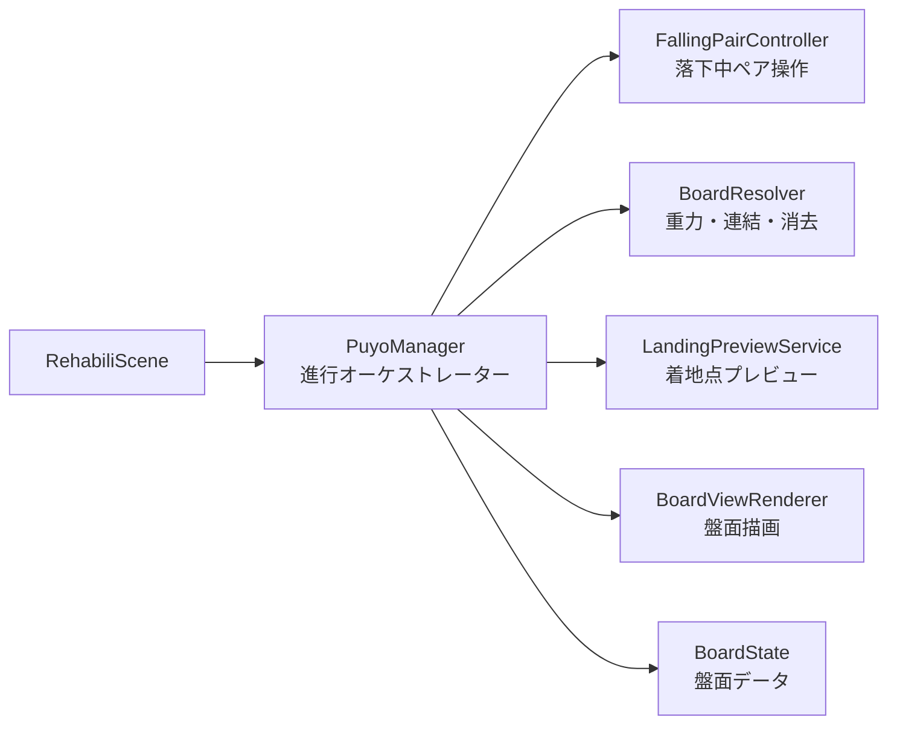
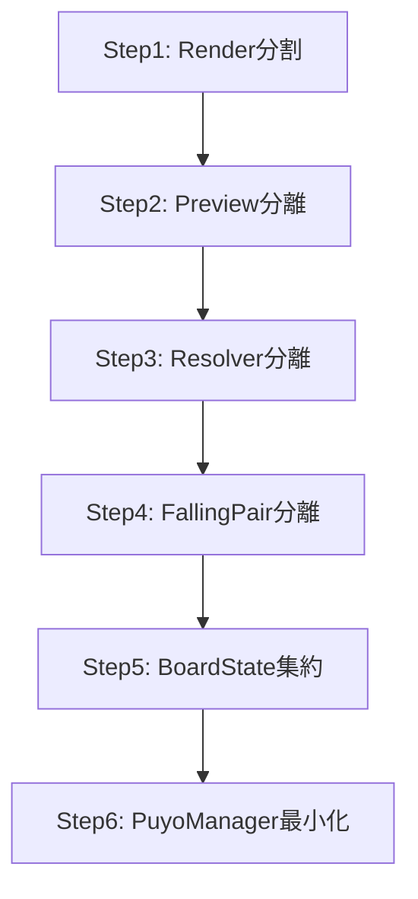
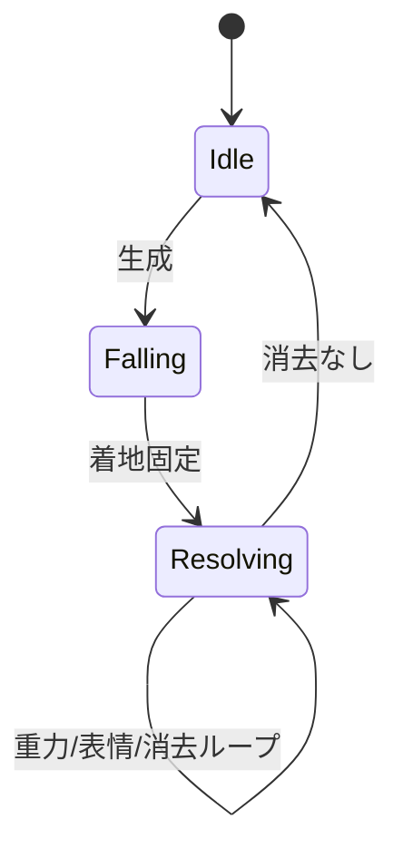
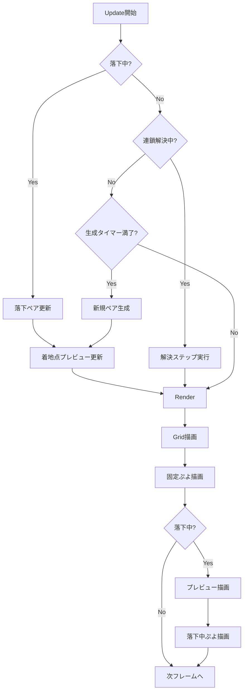
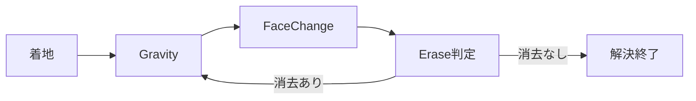

# `PuyoManager` リファクタリング方針書

## 1. 目的
`PuyoManager` に集中している責務を分割し、以下を改善する。

- 可読性
- 変更容易性（機能追加時の影響範囲）
- テストしやすさ
- バグ修正時の切り分け速度

---

## 2. 現状課題（要約）

- 1クラスで「入力」「落下」「盤面更新」「連鎖解決」「描画」「プレビュー」まで持っている
- 状態フラグが増え、`Update`/`ResolveBoard` の分岐が複雑化しやすい
- 描画系ロジック（プレビュー）とゲームロジックが密結合

---

## 3. 目標構成（責務分割）



---

## 4. 各コンポーネント責務

### `PuyoManager`（最終的に薄くする）
- ゲーム進行状態管理（`Falling` / `Resolving`）
- 各コンポーメント呼び出し順の制御のみ担当

### `BoardState`
- 固定盤面データ保持
- 基本判定 API（`IsInsideBoard`, `IsCellEmpty`）
- 座標変換（`GridToPosition`）

### `FallingPairController`
- `GeneratePuyo`
- `UpdateFallingPuyo`
- `TryMoveFallingPuyo`
- `TryRotateFallingPuyo`
- `LockFallingPuyo`

### `BoardResolver`
- `ApplyGravityToBoard`
- `CollectConnectedPuyo`
- `EraseConnectedPuyo`
- `ResolveBoard` の1ステップ進行

### `LandingPreviewService`
- `UpdateLandingPreview`
- プレビュー生成・更新・クリア

### `BoardViewRenderer`
- `RenderGrid`
- `RenderFixedPuyo`
- `RenderPreview`
- `RenderFallingPuyo`

---

## 5. 段階的移行プラン（安全優先）



### Step1: 描画分割
- `Render` 内を関数分割のみ（挙動不変）

### Step2: プレビュー分離
- `UpdateLandingPreview` とプレビュー配列管理を専用クラス化

### Step3: 連鎖解決分離
- `ResolveBoard` 系を `BoardResolver` へ移す

### Step4: 落下ペア分離
- 生成/移動/回転/着地を `FallingPairController` へ移す

### Step5: 盤面状態集約
- 盤面判定 API を `BoardState` に集約

### Step6: オーケストレーター化
- `PuyoManager` は「状態遷移＋呼び出し順」だけにする

---

## 6. 状態遷移の整理方針



- `PuyoManager` は遷移判定のみ保持
- 各状態の実処理は専用コンポーネントへ委譲

---

## 7. インターフェース方針（例）

- `BoardState`: `bool IsCellEmpty(col,row)`, `Vector2 GridToPosition(col,row)`
- `FallingPairController`: `Update(elapsedTime)`, `TryMove(dx,dy)`, `TryRotate(dir)`
- `BoardResolver`: `StepResult Step(elapsedTime)`
- `LandingPreviewService`: `Update(fallingPair, boardState)`, `Render()`

`StepResult` を返すと `PuyoManager` 側の分岐が単純化される。

---

## 8. 品質担保（各ステップ共通）

- ビルド成功
- 既存操作（左右/回転/自然落下）が同じ
- 連鎖挙動が同じ
- プレビュー表示位置が同じ
- 状態遷移ログ（必要なら一時的に）で差分確認

---

## 9. 完了条件

- `PuyoManager.cpp` は「進行制御中心」で 200?300行程度に圧縮
- 盤面ロジック、落下ロジック、描画補助がファイル単位で分離
- 新機能追加（例: 表情変更）時に1クラス修正で済む構造

---

## 10. 既存 `private` 関数の分配先（対応表）

| 既存関数 (`PuyoManager`) | 分配先クラス | 役割 |
|---|---|---|
| `GeneratePuyo` | `FallingPairController` | 落下ペア生成・初期化 |
| `UpdateFallingPuyo` | `FallingPairController` | 入力処理・自然落下更新 |
| `TryMoveFallingPuyo` | `FallingPairController` | ペア移動判定・反映 |
| `TryRotateFallingPuyo` | `FallingPairController` | ペア回転判定・反映 |
| `LockFallingPuyo` | `FallingPairController`（着地処理） + `BoardState`（固定反映） | 落下終了・盤面転写 |
| `ResolveBoard` | `BoardResolver` | 重力/表情/消去ステップ進行 |
| `ChangePuyoFaceBeforeErase` | `BoardResolver` | 消去前対象マーキング |
| `EraseConnectedPuyo` | `BoardResolver` | 4連結以上の消去 |
| `CollectConnectedPuyo` | `BoardResolver`（内部ヘルパー） | DFS連結収集 |
| `ApplyGravityToBoard` | `BoardResolver` | 列ごとの下詰め |
| `RecreateFixedPuyo` | `BoardState` | 固定セル再構築 |
| `SyncFallingPuyoPosition` | `FallingPairController` | 落下ペアの表示同期 |
| `IsInsideBoard` | `BoardState` | 盤面境界判定 |
| `IsCellEmpty` | `BoardState` | 空マス判定 |
| `IsFallingCellAt` | `FallingPairController` | 落下ペア占有判定 |
| `GridToPosition` | `BoardState` | 盤面→描画座標変換 |
| `UpdateLandingPreview` | `LandingPreviewService` | 着地予定座標計算・反映 |

> 注: `Render` 本体は `BoardViewRenderer` へ分解し、`PuyoManager` は呼び出しのみを担当する。

---

## 11. 呼び出し順（ランタイムシーケンス）

> Mermaid 図の代わりに、実装に合わせた「上から順に追える手順」で記載する。

### 11.1 `Update` フレーム内（基本順）

1. `PuyoManager`
   - 生成タイマーを更新する
2. 生成条件を判定する
   - 条件: `!isFalling && !isResolving && timer >= 間隔`
3. 条件を満たす場合
   - `FallingPairController.GeneratePair()`
   - `LandingPreviewService.CreateOrResetPreview()`
4. `BoardState` の固定盤面ぷよを `Update`
5. 状態分岐
   - `Falling` の場合
     1. `FallingPairController.UpdateFalling(elapsed)`
     2. `FallingPairController` 内で移動/回転可否を `BoardState` に問い合わせ
     3. 落下中ぷよスプライトを `Update`
     4. `LandingPreviewService.UpdatePreview(fallingPair, boardState)`
     5. プレビューぷよスプライトを `Update`
   - `Resolving` の場合
     1. `BoardResolver.StepResolve(elapsed)`
     2. `BoardResolver` 内で `ApplyGravity` / `MarkFace` / `Erase` を段階実行

#### `Update` の分岐早見表

| 条件 | 実行する処理 |
|---|---|
| `isFalling == true` | 落下中更新 + プレビュー更新 |
| `isFalling == false && isResolving == true` | 連鎖解決ステップ更新 |
| どちらでもない | 待機（次生成待ち） |

---

### 11.2 `Render` フレーム内（描画順）

1. `BoardViewRenderer.RenderGrid()`
2. `BoardViewRenderer.RenderFixed()`
3. `isFalling == true` の場合
   - `BoardViewRenderer.RenderLandingPreview()`
   - `BoardViewRenderer.RenderFallingPuyo()`

#### レイヤ順（見た目）

- 背景グリッド
- 固定ぷよ
- 着地点プレビュー
- 落下中ぷよ（最前面）

---

### 11.3 着地後の解決ループ（1秒ステップ）

`LockFallingPuyo` 後は、以下を1ステップずつ繰り返す。

1. `Gravity`（重力落下）
2. `FaceChange`（消去前表情マーキング）
3. `Erase`（4連結以上消去判定）

`Erase` の結果:
- 消去あり → `Gravity` に戻る（連鎖継続）
- 消去なし → 解決終了、次生成待ちへ遷移

#### 文字フロー

`Lock` -> `Gravity` -> `FaceChange` -> `Erase` -> (`消去あり` ? `Gravity` : `End`)

---

## 12. 先に手を付ける具体順（関数単位）

1. `Render` 分割
   - `RenderGrid` / `RenderFixed` / `RenderPreview` / `RenderFalling`
2. `UpdateLandingPreview` 抽出
3. `ResolveBoard`, `ChangePuyoFaceBeforeErase`, `EraseConnectedPuyo`, `CollectConnectedPuyo`, `ApplyGravityToBoard` 抽出
4. `GeneratePuyo`, `UpdateFallingPuyo`, `TryMoveFallingPuyo`, `TryRotateFallingPuyo`, `LockFallingPuyo`, `SyncFallingPuyoPosition` 抽出
5. `IsInsideBoard`, `IsCellEmpty`, `GridToPosition`, `RecreateFixedPuyo` を `BoardState` に集約

この順なら、毎段階で挙動差分を小さく保てる。

---

## 13. 既存メンバー変数の移設先（対応表）

| 既存メンバー (`PuyoManager`) | 移設先クラス | 用途 |
|---|---|---|
| `m_pCommonResources` | `PuyoManager`（親保持） | 共通リソース参照（各コンポーネントへ注入） |
| `m_time` | `PuyoManager` | 新規生成タイマー |
| `m_isFalling` | `PuyoManager` | 全体状態（落下中） |
| `m_isResolving` | `PuyoManager` | 全体状態（連鎖解決中） |
| `m_resolveNeedsGravity` | `BoardResolver` | 解決ステップ制御（重力） |
| `m_resolveNeedsFaceChange` | `BoardResolver` | 解決ステップ制御（表情変更） |
| `m_resolveNeedsErase` | `BoardResolver` | 解決ステップ制御（消去） |
| `m_resolveTimer` | `BoardResolver` | 解決ステップ用タイマー |
| `m_pFixedPuyo[6][12]` | `BoardState` | 固定盤面データ |
| `m_pPuyoGrid[6][12]` | `BoardViewRenderer`（または `BoardState`） | 背景グリッド表示 |
| `m_pFallingPuyo[3][3]` | `FallingPairController` | 落下中2連ぷよデータ |
| `m_fallCenterCol` | `FallingPairController` | 軸ぷよ列 |
| `m_fallCenterRow` | `FallingPairController` | 軸ぷよ行 |
| `m_subOffsetCol` | `FallingPairController` | 子ぷよ相対列 |
| `m_subOffsetRow` | `FallingPairController` | 子ぷよ相対行 |
| `m_fallTimer` | `FallingPairController` | 自然落下タイマー |
| `m_prevLeftKey` | `FallingPairController` | 入力エッジ判定（左） |
| `m_prevRightKey` | `FallingPairController` | 入力エッジ判定（右） |
| `m_prevAKey` | `FallingPairController` | 入力エッジ判定（左回転） |
| `m_prevDKey` | `FallingPairController` | 入力エッジ判定（右回転） |
| `m_pLandingPreviewPuyo[2]` | `LandingPreviewService` | 着地点プレビュー表示 |

> 補足: `PuyoManager` は状態遷移に必要な最小限のみ保持し、詳細データは各責務クラスに寄せる。

---

## 14. シンプルなフローチャート（全体）



### 解決ステップ内部（簡易）



---

## 15. 分割後の関数フロー（擬似コード・網羅版）

> ここでは「分割後に存在する関数」をクラスごとに、呼び出し順と条件分岐が追える形で列挙する。

### 15.1 `PuyoManager`（根元）

#### `PuyoManager::Initialize(resources)`

```cpp
void Initialize(CommonResources* resources)
{
    common = resources;

    boardState.Initialize(common);            // 固定盤面・空マス初期化
    boardViewRenderer.Initialize(common);     // グリッド等の描画準備
    fallingPairController.Initialize(common); // 落下ペア領域初期化
    landingPreviewService.Initialize(common); // プレビュー初期化
    boardResolver.Initialize();               // 解決ステップ状態初期化

    isFalling = false;
    isResolving = false;
    spawnTimer = 0.0f;
}
```

#### `PuyoManager::Update(elapsedTime)`

```cpp
void Update(float elapsedTime)
{
    // 1) 生成タイマー更新
    spawnTimer += elapsedTime;

    // 2) 新規生成判定（待機中のみ）
    if (!isFalling && !isResolving && spawnTimer >= spawnInterval)
    {
        bool generated = fallingPairController.GeneratePuyo(boardState);
        if (generated)
        {
            landingPreviewService.CreateOrResetPreview(fallingPairController);
            landingPreviewService.UpdateLandingPreview(fallingPairController, boardState);
            isFalling = true;
            spawnTimer = 0.0f;
        }
    }

    // 3) 固定盤面ぷよ更新
    boardState.UpdateFixedPuyos(elapsedTime);

    // 4) 状態分岐
    if (isFalling)
    {
        FallingUpdateResult r = fallingPairController.UpdateFallingPuyo(elapsedTime, boardState);

        fallingPairController.UpdateSprites(elapsedTime);
        landingPreviewService.UpdateLandingPreview(fallingPairController, boardState);
        landingPreviewService.UpdateSprites(elapsedTime);

        if (r == FallingUpdateResult::Locked)
        {
            landingPreviewService.Clear();
            isFalling = false;
            isResolving = true;
            boardResolver.BeginResolve();
        }
    }
    else if (isResolving)
    {
        StepResult s = boardResolver.StepResolve(elapsedTime, boardState);
        if (s == StepResult::Resolved)
        {
            isResolving = false;
            spawnTimer = spawnInterval; // 次フレームで生成可能
        }
    }
}
```

#### `PuyoManager::Render()`

```cpp
void Render()
{
    boardViewRenderer.RenderGrid(boardState);
    boardViewRenderer.RenderFixedPuyo(boardState);

    if (isFalling)
    {
        boardViewRenderer.RenderLandingPreview(landingPreviewService);
        boardViewRenderer.RenderFallingPuyo(fallingPairController);
    }
}
```

---

### 15.2 `FallingPairController`（落下ペア）

#### `GeneratePuyo(boardState)`

```cpp
bool GeneratePuyo(BoardState& board)
{
    SetInitialPose(center=(2,1), subOffset=(0,-1));

    if (!board.IsCellEmpty(center) || !board.IsCellEmpty(sub))
        return false;

    ClearFallingSlots();
    CreateCenterAndSubWithRandomColor();
    InitializeSprites(common);
    SyncFallingPuyoPosition(board);
    return true;
}
```

#### `UpdateFallingPuyo(elapsedTime, boardState)`

```cpp
FallingUpdateResult UpdateFallingPuyo(float dt, BoardState& board)
{
    ReadInputEdge();

    if (leftPressed)  TryMoveFallingPuyo(-1, 0, board);
    if (rightPressed) TryMoveFallingPuyo( 1, 0, board);
    if (aPressed)     TryRotateFallingPuyo(false, board);
    if (dPressed)     TryRotateFallingPuyo(true,  board);

    fallTimer += dt;
    if (fallTimer >= fallInterval)
    {
        fallTimer = 0.0f;
        if (!TryMoveFallingPuyo(0, 1, board))
        {
            LockFallingPuyo(board);
            return FallingUpdateResult::Locked;
        }
    }
    return FallingUpdateResult::None;
}
```

#### `TryMoveFallingPuyo(dx, dy, boardState)`

```cpp
bool TryMoveFallingPuyo(int dx, int dy, const BoardState& board)
{
    ComputeNextCenterAndSub(dx, dy);
    if (!board.IsInsideBoard(nextCenter) || !board.IsInsideBoard(nextSub)) return false;
    if (!board.IsCellEmpty(nextCenter) || !board.IsCellEmpty(nextSub))     return false;

    ApplyCenter(nextCenter);
    SyncFallingPuyoPosition(board);
    return true;
}
```

#### `TryRotateFallingPuyo(isRight, boardState)`

```cpp
void TryRotateFallingPuyo(bool isRight, const BoardState& board)
{
    nextOffset = isRight ? RotateRight(subOffset) : RotateLeft(subOffset);
    nextSub = center + nextOffset;

    if (!board.IsInsideBoard(nextSub)) return;
    if (!board.IsCellEmpty(nextSub))   return;

    MoveSubSlot(oldOffset=subOffset, newOffset=nextOffset);
    subOffset = nextOffset;
    SyncFallingPuyoPosition(board);
}
```

#### `LockFallingPuyo(boardState)`

```cpp
void LockFallingPuyo(BoardState& board)
{
    if (!HasCenterPuyo()) return;

    // 軸・子を固定盤面へ転写
    board.RecreateFixedPuyo(center.col, center.row, center.color);
    board.RecreateFixedPuyo(sub.col,    sub.row,    sub.color);

    ClearFallingSlots();
    fallTimer = 0.0f;
}
```

#### `SyncFallingPuyoPosition(boardState)`

```cpp
void SyncFallingPuyoPosition(const BoardState& board)
{
    if (!HasCenterPuyo()) return;

    centerPuyo.SetRowCol(center.row, center.col);
    centerPuyo.SetPosition(board.GridToPosition(center.col, center.row));

    if (HasSubPuyo())
    {
        subPuyo.SetRowCol(sub.row, sub.col);
        subPuyo.SetPosition(board.GridToPosition(sub.col, sub.row));
    }
}
```

#### `IsFallingCellAt(col,row)`

```cpp
bool IsFallingCellAt(int col, int row) const
{
    return (center matches) || (sub matches);
}
```

---

### 15.3 `BoardResolver`（重力・表情・消去）

#### `BeginResolve()`

```cpp
void BeginResolve()
{
    resolveTimer = 0.0f;
    needsGravity = true;
    needsFaceChange = false;
    needsErase = false;
}
```

#### `StepResolve(elapsedTime, boardState)`

```cpp
StepResult StepResolve(float dt, BoardState& board)
{
    resolveTimer += dt;
    if (resolveTimer < resolveInterval) return StepResult::InProgress;
    resolveTimer = 0.0f;

    if (needsGravity)
    {
        ApplyGravityToBoard(board);
        needsGravity = false;
        needsFaceChange = true;
        return StepResult::InProgress;
    }

    if (needsFaceChange)
    {
        ChangePuyoFaceBeforeErase(board);
        needsFaceChange = false;
        needsErase = true;
        return StepResult::InProgress;
    }

    if (needsErase)
    {
        bool erased = EraseConnectedPuyo(board);
        if (erased)
        {
            needsErase = false;
            needsGravity = true;
            return StepResult::InProgress;
        }

        // 消去なしで解決終了
        needsGravity = needsFaceChange = needsErase = false;
        return StepResult::Resolved;
    }

    return StepResult::InProgress;
}
```

#### `ApplyGravityToBoard(boardState)`

```cpp
bool ApplyGravityToBoard(BoardState& board)
{
    bool changed = false;
    for each col
    {
        writeRow = bottom;
        for row = bottom..top
        {
            if (board.Fixed[row][col] is None) continue;
            if (row != writeRow)
            {
                MovePuyoTo(writeRow);
                StartSmoothMove(to board.GridToPosition(col, writeRow));
                board.RecreateFixedPuyo(col, row, None);
                changed = true;
            }
            writeRow--;
        }
    }
    return changed;
}
```

#### `ChangePuyoFaceBeforeErase(boardState)`

```cpp
void ChangePuyoFaceBeforeErase(BoardState& board)
{
    visited = false;
    for each cell
    {
        if (visited || color==None) continue;
        connected = CollectConnectedPuyo(...);
        if (connected.size >= 4)
        {
            for each c in connected
            {
                // TODO: 消去前表情フラグを立てる
            }
        }
    }
}
```

#### `EraseConnectedPuyo(boardState)`

```cpp
bool EraseConnectedPuyo(BoardState& board)
{
    visited = false;
    eraseCells = {};

    for each cell
    {
        if (visited || color==None) continue;
        connected = CollectConnectedPuyo(...);
        if (connected.size >= 4) eraseCells += connected;
    }

    if (eraseCells.empty()) return false;
    for each e in eraseCells
        board.RecreateFixedPuyo(e.col, e.row, None);

    return true;
}
```

#### `CollectConnectedPuyo(...)`

```cpp
void CollectConnectedPuyo(col,row,color,visited,out)
{
    if (!inside) return;
    if (visited) return;
    if (boardColor != color) return;

    visited = true;
    out.push(col,row);

    DFS(left); DFS(right); DFS(up); DFS(down);
}
```

---

### 15.4 `BoardState`（盤面データ）

#### `RecreateFixedPuyo(col,row,color)`

```cpp
void RecreateFixedPuyo(int col, int row, PuyoColor color)
{
    fixed[col][row] = MakePuyo(color);
    fixed[col][row].SetRowCol(row, col);
    fixed[col][row].SetPosition(GridToPosition(col, row));
    fixed[col][row].Initialize(common);
}
```

#### `IsInsideBoard(col,row)`

```cpp
bool IsInsideBoard(int col, int row) const
{
    return 0 <= col < 6 && 0 <= row < 12;
}
```

#### `IsCellEmpty(col,row)`

```cpp
bool IsCellEmpty(int col, int row) const
{
    if (!IsInsideBoard(col, row)) return false;
    return fixed[col][row].GetColor() == None;
}
```

#### `GridToPosition(col,row)`

```cpp
Vector2 GridToPosition(int col, int row) const
{
    return Vector2(0.4f + col*0.05f, 0.045f + row*0.0826f);
}
```

#### `UpdateFixedPuyos(elapsedTime)`

```cpp
void UpdateFixedPuyos(float dt)
{
    for each fixed puyo
        puyo.Update(dt);
}
```

---

### 15.5 `LandingPreviewService`（着地点プレビュー）

#### `CreateOrResetPreview(fallingPair)`

```cpp
void CreateOrResetPreview(const FallingPairController& falling)
{
    Clear();
    preview[0] = MakePuyo(falling.CenterColor());
    preview[1] = MakePuyo(falling.SubColor());
    preview[0].Initialize(common);
    preview[1].Initialize(common);
}
```

#### `UpdateLandingPreview(fallingPair, boardState)`

```cpp
void UpdateLandingPreview(const FallingPairController& falling, const BoardState& board)
{
    if (!falling.HasPair()) return;

    drop = 0;
    while (CanDropOneMore(falling, board, drop))
        drop++;

    SetPreviewPosition(center.row + drop, sub.row + drop);
}
```

#### `UpdateSprites(elapsedTime)`

```cpp
void UpdateSprites(float dt)
{
    if (preview[0]) preview[0].Update(dt);
    if (preview[1]) preview[1].Update(dt);
}
```

#### `Clear()`

```cpp
void Clear()
{
    preview[0].reset();
    preview[1].reset();
}
```

---

### 15.6 `BoardViewRenderer`（描画）

#### `RenderGrid(boardState)`

```cpp
void RenderGrid(const BoardState& board)
{
    for each grid cell
        grid.Render();
}
```

#### `RenderFixedPuyo(boardState)`

```cpp
void RenderFixedPuyo(const BoardState& board)
{
    for each fixed puyo
        puyo.Render();
}
```

#### `RenderLandingPreview(previewService)`

```cpp
void RenderLandingPreview(const LandingPreviewService& preview)
{
    if (preview[0]) preview[0].Render();
    if (preview[1]) preview[1].Render();
}
```

#### `RenderFallingPuyo(fallingPairController)`

```cpp
void RenderFallingPuyo(const FallingPairController& falling)
{
    for each falling slot
        if (puyo exists) puyo.Render();
}
